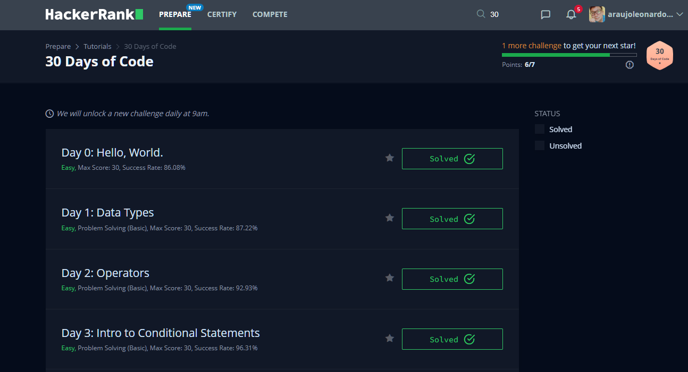

# Projeto: 30 Days of Code 👨‍💻

## Sobre: 

Este repositório possuí exercícios e atividades desenvolvidas na jornada **30 Days Of Code** no HackerRank.

## Linguagens & Tecnologias 
 - Java 8

## Referências
- [HackerRank](https://www.hackerrank.com)	
  > Sobre:	HackerRank is a technology hiring platform that is the standard for assessing developer skills for over 2,800+ companies around the world. By enabling tech recruiters and hiring managers to objectively evaluate talent at every stage of the recruiting process, HackerRank helps companies hire skilled developers and innovate faster!

- [blondiebytes](https://www.youtube.com/c/KathrynHodgeblondiebytes/featured)	
  > Sobre: Start learning how to code right now. I make new programming tutorials (almost) every week :) Support on Patreon: https://www.patreon.com/blondiebytes Behind the Scenes + MORE TECH content: https://www.instagram.com/blondiebytes/?hl=en LinkedIn Learning Courses: https://www.linkedin.com/learning/instructors/kathryn-hodge Python Basics Highbrow Email Course: https://gohighbrow.com/portfolio/python-basics/
